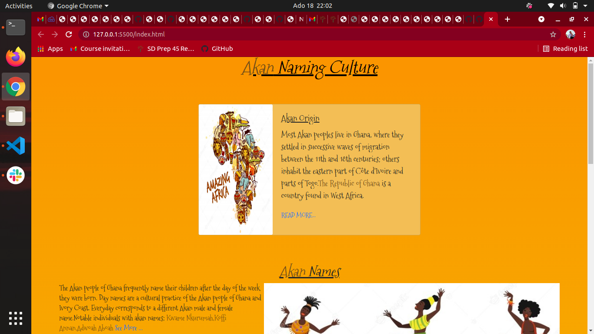
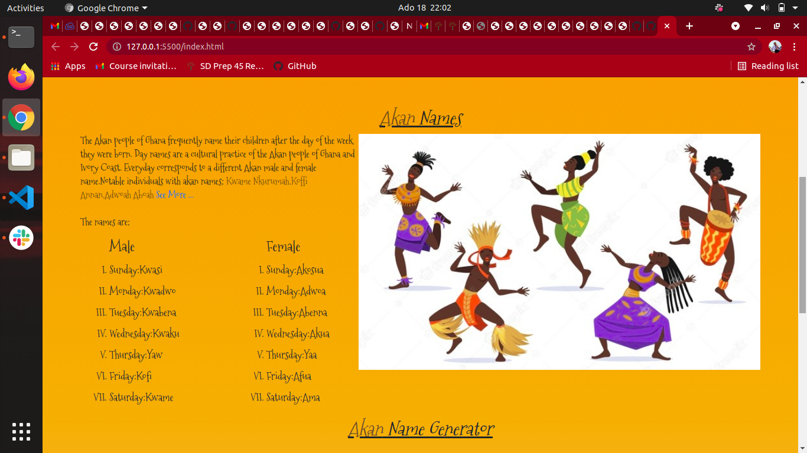
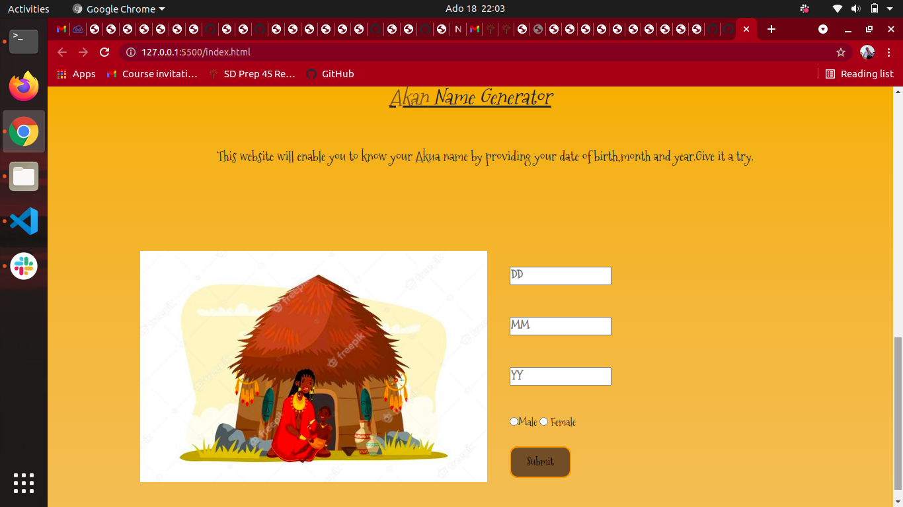

# AKAN NAMES PROJECT
### The project was created by TERESIA KING'ORI.
______
#### The Akan Project is a website that enables one to generate an Akan Name.Akan names are names that are used by Akan People in  Ghana,Africa.The unique thing with their names is they name children according to the time of the day one was born.
## How it works
____
#### Submit your;
* Date of birth
* Month of birth
* Year of birth
### Your Akan Name will be displayed.
____
## Setup Requirements/Installation
* Github
* Git
* Web Browser
* Click the Github Link
______
## Technologies Used
* HTML
* CSS
* BOOTSTRAP
* JAVASCRIPT
____
### <a href=" https://teresia012.github.io/akan_names_project/">Live link</a>
____
## Licence
### <a href="https://choosealicense.com/licenses/mit/">MIT</a>
________
## &copy;2021 All Rights Reserved!
____
## Screenshots.

